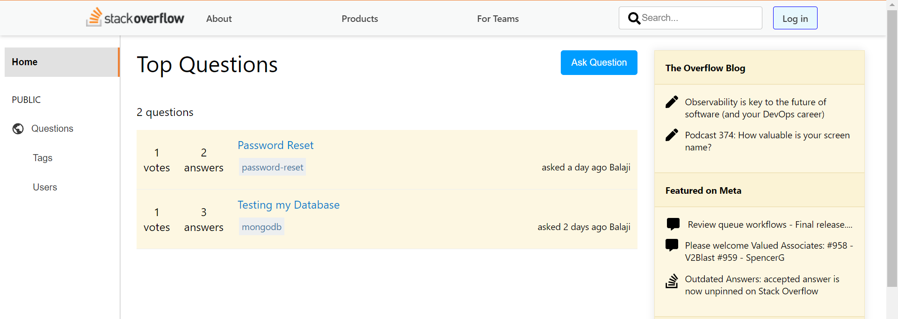
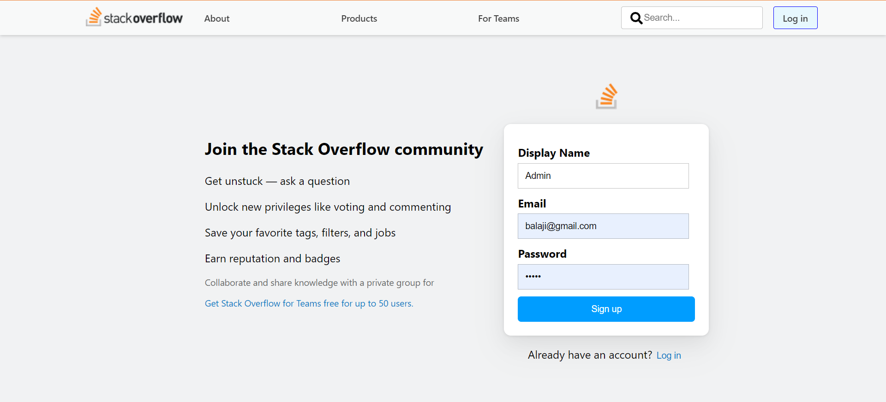
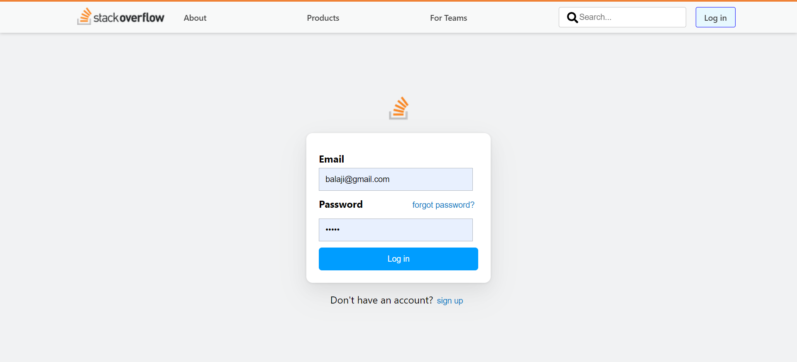
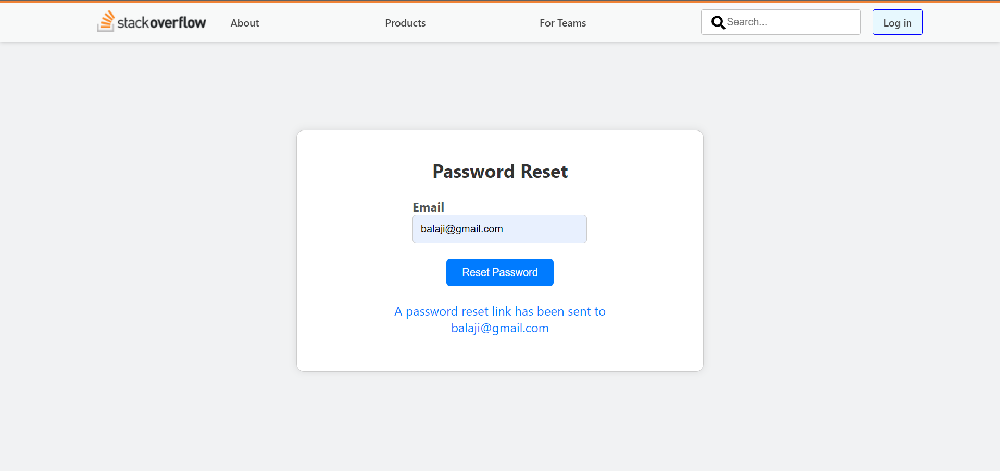

# Stackoverflow

A a full-stack web application akin to Stack Overflow (questionnaire forum)

---

---

## Technologies used:

- React js
- Node js
- Express js
- MongoDB
- Redux
- JWT and more

---

## Contributors

- Balaji

---

## License & Copyright

Copyright [©balaji](https://github.com/balajirai)

Licensed under the [MIT License](LICENSE)